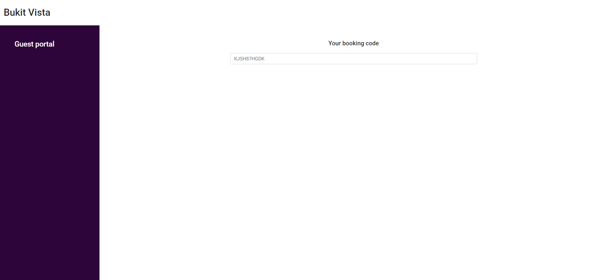
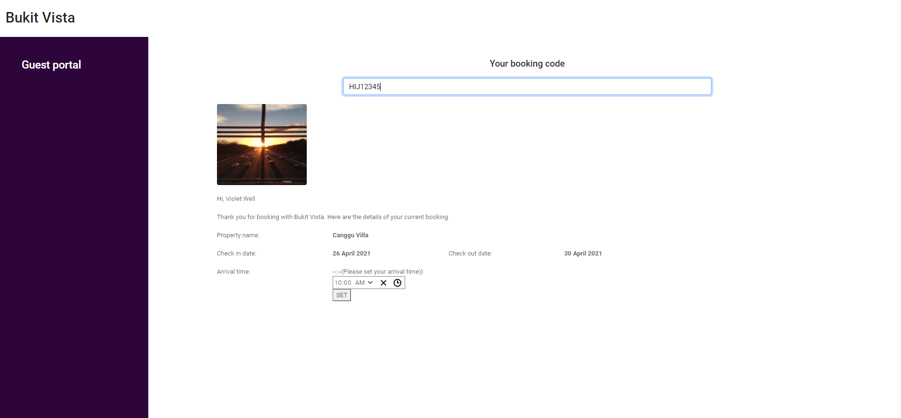

# Bukit Vista

## Problem Statement

Make an interface for users to check thier bookings through thier booking code and add thier arrival time at Bukit Vista. 

## API

https://bv-online-assessment.herokuapp.com/api

## Tools used 
* React

## Snippets

### (Page 1)

### (Page 2)

### (Page 3)

### How to Run 
* 1)Simply just clone the repo and start by doing npm install
* 2)Npm start

